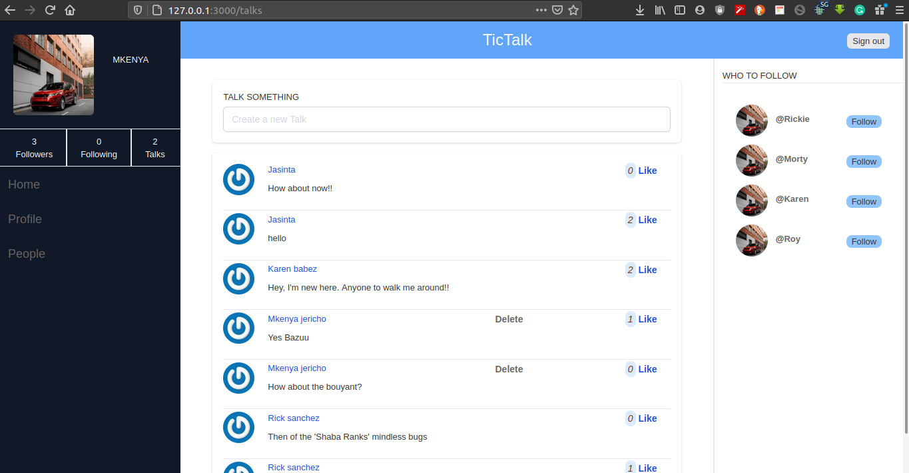
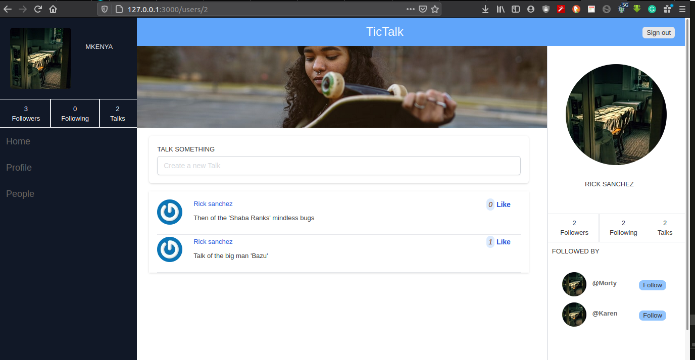

# TicTalk

> The socializing App is built as the RoR capstone project. It's a discussion platform where various kinds of conversations can be held be it politics, sports, education, exetra.

> The MVC concepts of RoR have been used to provide functionality, control and UIs for TicTalk.





## Built and tested With

- Ruby
- Ruby on Rails
- HTML 5
- Tailwind CSS
- RSpec

## Live Demo

<!-- [Live Demo](https://.heagit add -bottom-0.com/) -->


## Getting Started

To get a local copy up and running follow these simple example steps.

### Prerequisites

- Ruby: 2.7.0
- Rails: 6.0
- Postgres: >=9.5

### Setup

~~~bash

$ git clone https://github.com/mke2111/Talks-ROR.git
$ cd Talks-ROR
~~~

Install gems with:

```
bundle install
```

Setup database with:

> make sure you have postgress sql installed and running on your system

```
   rails db:create
   rails db:migrate
```

### Usage

Start server with:

```
    rails server
```

Open `http://localhost:3000/` in your browser.

### Run tests

```
    rpsec 
```

## Author 

👤 **Roy Mukuye**

- GitHub: [@mke2111](https://github.com/mke2111)
- Twitter: [@Roymkenya](https://twitter.com/Roymkenya)
- LinkedIn: [Roy Mukuye](https://www.linkedin.com/in/roy-mukuye-42b07b1b4)


## 🤝 Contributing

Contributions, issues and feature requests are welcome!

Feel free to check the [issues page](https://github.com/mke2111/Talks-ROR/issues/).

## Show your support

Give a ⭐️ if you like this project!

## Acknowledgments

- [Gregoire Vella on Behance](https://www.behance.net/gregoirevella)

## 📝 License

This project is [MIT](https://opensource.org/licenses/MIT) licensed.


